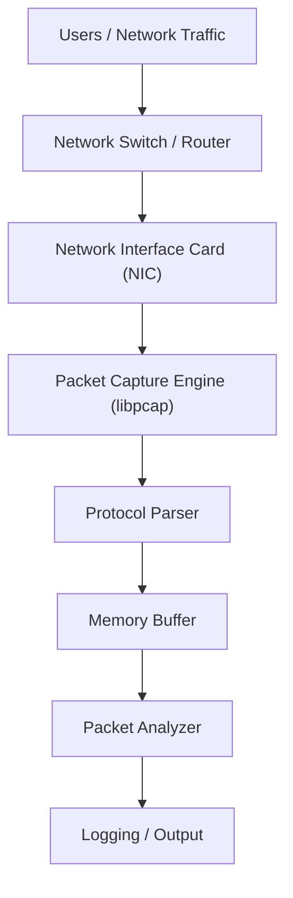
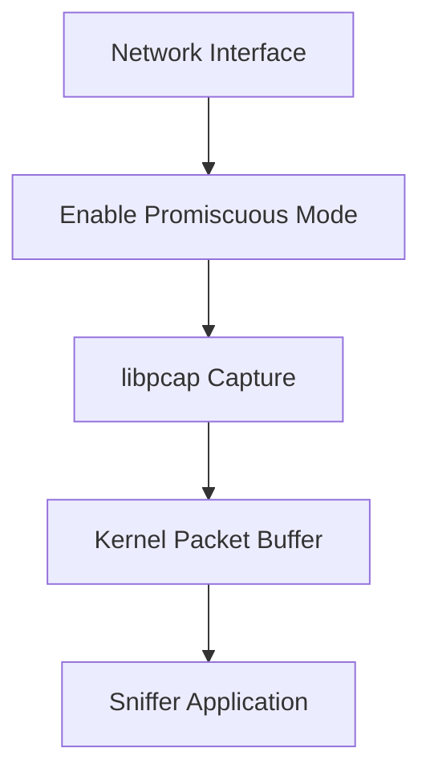
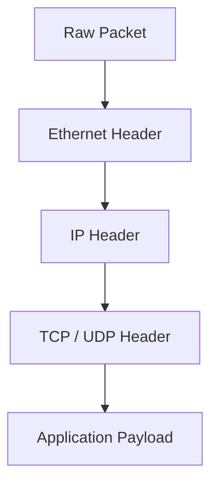
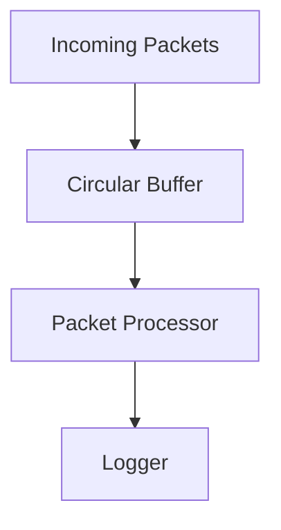
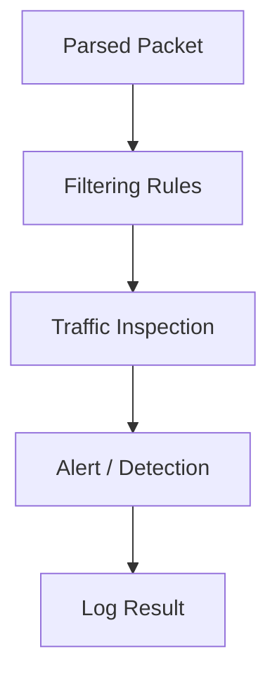
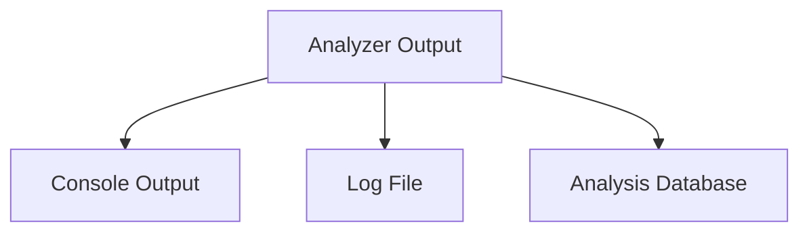
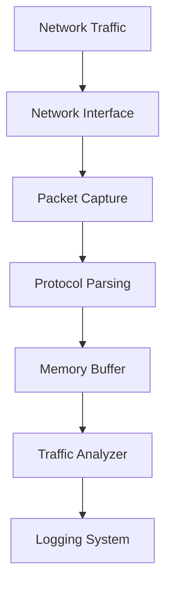
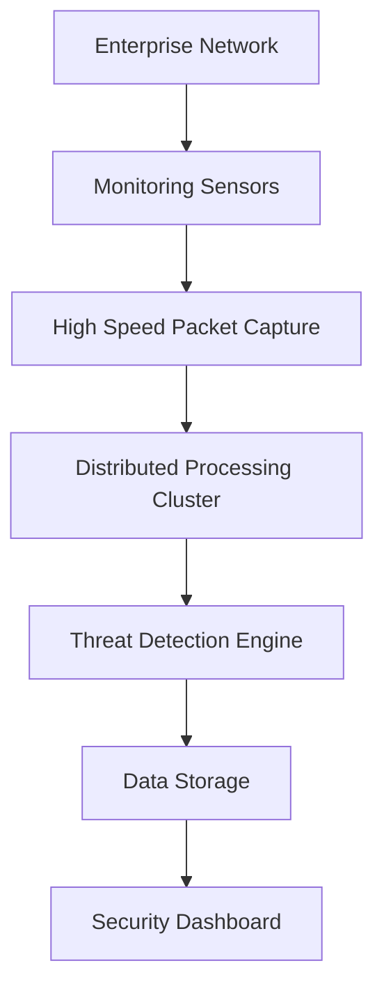
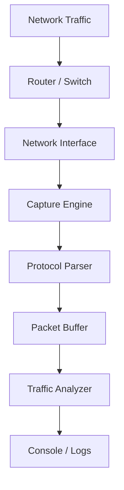

# LAB ARCHITECTURE GUIDE
# NetScout Sniffer Project – Complete Student Guide with Flowcharts

## Overview

This guide walks students through the architecture and workflow of a **network packet sniffer** similar to those used in real-world network monitoring and cybersecurity systems. The goal is to help students understand:

* How packets move through a system
* How sniffers capture and process traffic
* How real industry tools follow similar architectures

This project represents a **simplified version of professional network monitoring tools**.

---

# 1. System Architecture Overview

This diagram shows the **entire packet-processing pipeline** from network traffic through logging and analysis.



### Explanation

1. **Users generate traffic**
2. Traffic flows through a **switch or router**
3. The **network interface card receives packets**
4. The **capture engine collects packets**
5. The **parser extracts protocol headers**
6. Packets are stored in a **temporary buffer**
7. The **analyzer inspects packets**
8. Results are **logged or displayed**

---

# 2. Packet Capture Flow

This flowchart explains **how packets are captured from the network interface**.



### Key Concepts

**Promiscuous Mode**

Allows the NIC to capture **all packets on the network**, not just those addressed to the machine.

**libpcap**

Library used to:

* capture packets
* apply filters
* deliver packets to the application

---

# 3. Packet Parsing Flow

After packets are captured, they must be **decoded into protocol layers**.



### Parsing Process

1. Extract **Ethernet header**
2. Identify **IP packet**
3. Determine **transport protocol**
4. Access the **payload**

Students implement this using structures like:

```
struct ethhdr
struct iphdr
struct tcphdr
struct udphdr
```

---

# 4. Memory Buffering Flow

Buffers prevent packet loss during heavy traffic.



### Why Buffers Are Important

Without buffering:

* packets arrive faster than they can be processed
* packets get dropped

A **circular buffer** allows continuous storage.

---

# 5. Packet Analysis Flow

The analyzer determines **what packets are important**.



### Example Filters

Students may implement:

* filter by **IP address**
* filter by **port**
* filter by **protocol**
* detect **suspicious traffic**

Example rule:

```
if (packet.port == 80)
    print("HTTP traffic detected");
```

---

# 6. Logging and Output Flow

Captured and analyzed packets must be recorded.



### Common Output Formats

Students may log:

```
Timestamp | Source IP | Destination IP | Protocol | Port
```

Example:

```
12:03:15 192.168.1.10 -> 8.8.8.8 TCP Port 443
```

---

# 7. Full End-to-End Sniffer Flow

This diagram combines **all major stages**.



---

# 8. Industry System Comparison

Large production systems follow **very similar architectures**.

| System           | Industry Use                    |
| ---------------- | ------------------------------- |
| Redis            | Distributed caching             |
| Apache Cassandra | Large distributed databases     |
| Amazon DynamoDB  | Massive key-value storage       |
| Wireshark        | Packet inspection and debugging |
| NetScout         | Enterprise network monitoring   |
| Snort            | Intrusion detection             |

---

# 9. Architecture Comparison with Industry Tools

### Student Project Architecture

```
NIC → Capture → Parse → Buffer → Analyze → Log
```

### Real Enterprise Monitoring Systems

```
NIC → Capture Engine → Distributed Processing → Threat Detection → Storage → Visualization
```

---

# 10. Real Industry Architecture Example



### Where This Appears in Industry

Large companies use similar pipelines for:

* cybersecurity monitoring
* network performance monitoring
* intrusion detection
* traffic analysis
* fraud detection

---

# 11. How This Connects to Real Systems

Students should understand that their project is **a miniature version of large distributed systems**.

| Concept        | Student Project  | Industry Equivalent             |
| -------------- | ---------------- | ------------------------------- |
| Packet capture | libpcap          | hardware packet capture engines |
| Parser         | protocol structs | deep packet inspection engines  |
| Buffer         | memory arrays    | distributed streaming systems   |
| Analyzer       | rule filters     | AI detection engines            |
| Logger         | log file         | large data storage clusters     |

This project demonstrates the **core pipeline used by professional monitoring tools**.

---

# 12. Final Learning Outcome

By completing this project students learn:

* network packet structure
* protocol decoding
* systems programming
* memory buffering
* real-time data processing
* monitoring system design

These concepts form the foundation for careers in:

* cybersecurity
* network engineering
* distributed systems
* systems programming
* cloud infrastructure

---

# 13. Quick Reference Diagram (Student Cheat Sheet)



This diagram summarizes the **entire system workflow students implement**.

---
