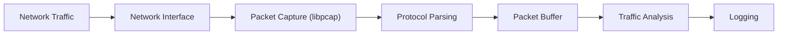

# 01 – NetScout Sniffer

Low-Level Network Analysis and Packet Inspection

---

## System Architecture

---

## Project Navigation

| Section | Description |
|--------|-------------|
| [Lab Guide](LAB_GUIDE.md) | Step-by-step implementation instructions |
| [Architecture Deep Dive](ARCHITECTURE.md) | Detailed system design and diagrams |
| [Student Cheat Sheet](CHEATSHEET.md) | Quick reference while coding |
| [Source Code](src/) | Implementation files |

---
## Learning Path

Follow the project in this order:

1️⃣ Read the **README** for the project overview  
2️⃣ Follow the **Lab Guide** to implement the sniffer  
3️⃣ Use the **Cheat Sheet** while coding  
4️⃣ Review the **Architecture** to understand the system design

Click to expand Instructor Notes / Advanced Topics

### Advanced Packet Capture Tips
- Use **libpcap filters** to reduce noise (e.g., only capture TCP port 80).
- Explore **promiscuous mode** vs **non-promiscuous mode** for network interfaces.
- Consider **packet timestamps** for accurate traffic analysis.

### Performance Considerations
- Buffering strategies: ring buffer vs dynamic buffer allocation.
- Trade-offs between real-time analysis vs logging for later inspection.
- Memory management when parsing high-throughput traffic.

### Extensions / Optional Exercises
- Implement support for IPv6 packets.
- Add protocol-specific parsers (e.g., HTTP, DNS, ICMP).
- Integrate visualization of traffic patterns.

