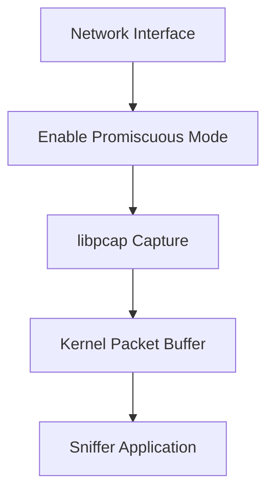
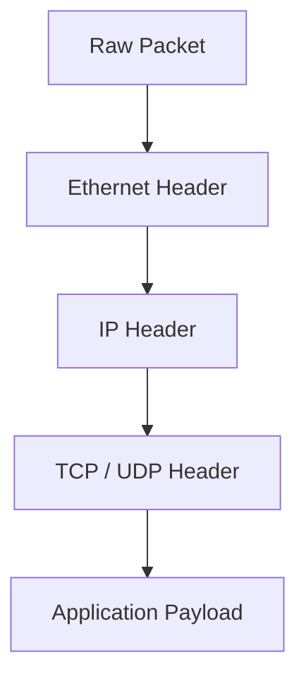
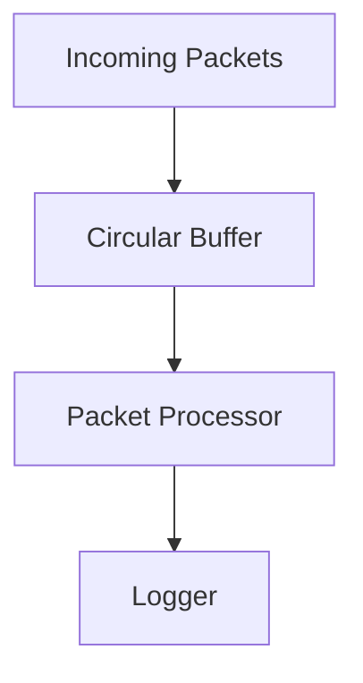
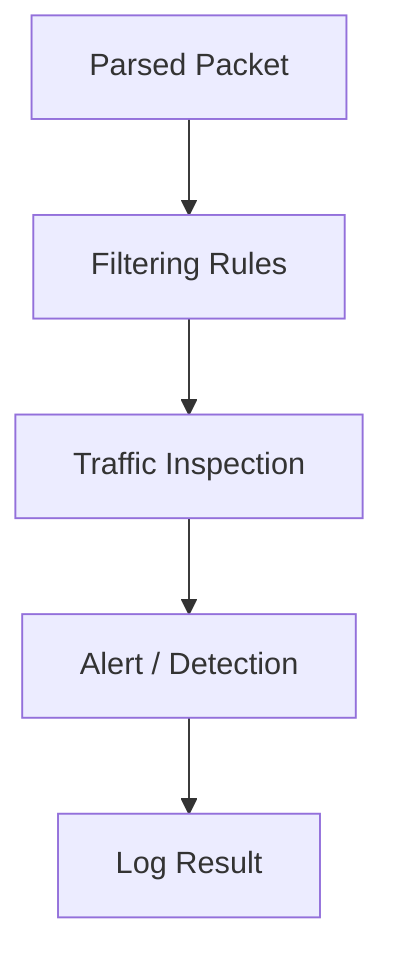
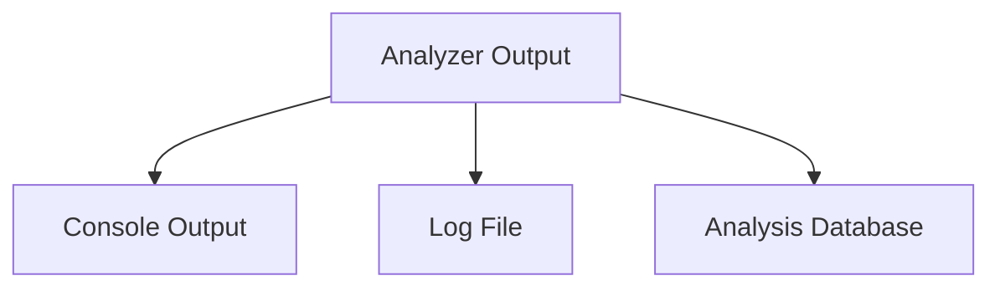
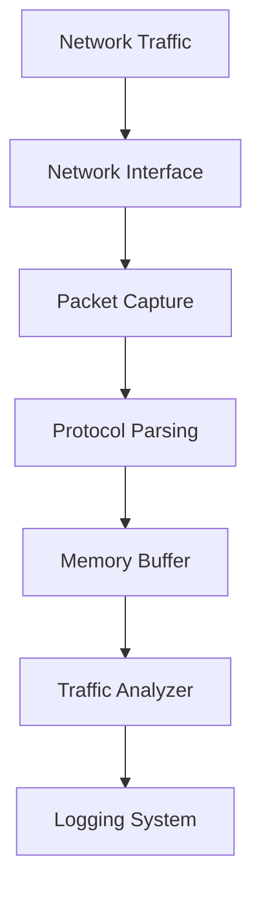
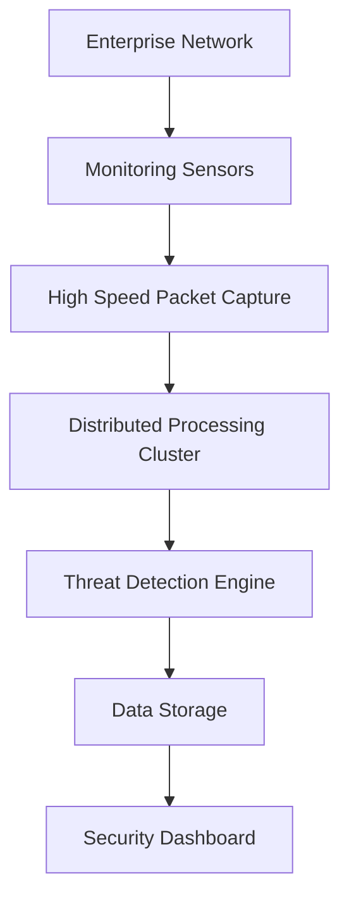
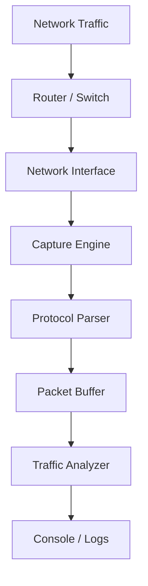
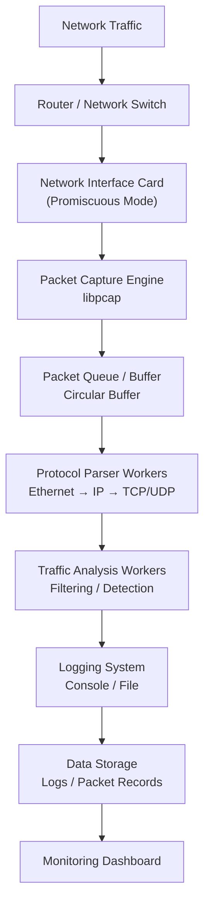

# 01-NetScout Sniffer

**Low-Level Network Analysis and Packet Inspection**

---

## Architectural Overview

NetScout is a high-performance network analysis tool designed to interface directly with the **data link layer**. Unlike typical applications that operate at higher levels, this project challenges you to **work with raw network packets**, giving you an insider’s view of how networks operate under the hood.  

By bypassing the standard application-level networking stack, you will:

* **Deconstruct protocol headers manually**, gaining deep insight into Ethernet, IP, and TCP/UDP layers.  
* **Handle raw packet streams**, simulating the operations of enterprise-grade network analyzers.  
* **Implement high-performance packet processing**, preparing you for real-world network engineering challenges.

Completing this project gives you **a concrete, hands-on understanding of networking fundamentals** that few beginner projects provide.

---

## Why This Matters

Working on this project will equip you with skills that are **directly applicable in the tech industry**:

* **Network troubleshooting:** Identify bottlenecks and anomalies at the packet level.  
* **Security analysis:** Detect unusual traffic patterns, which is crucial for intrusion detection.  
* **Performance optimization:** Learn how efficient memory management and processing affect throughput.  
* **Understanding real systems:** Tools like Wireshark, NetScout, and SolarWinds operate on the same principles you’ll implement here.

By completing this project, you’re not just writing code—you’re building **the foundations of professional network engineering expertise**.

---

## Technical Requirements

* <span style="color:#ff6f61;">**Packet Capture Engine**</span>: Implement a continuous capture loop using the `libpcap` library, interfacing with your network hardware.  
* <span style="color:#6f4fff;">**Protocol Deconstruction**</span>: Manually parse Ethernet, IP, and TCP/UDP headers using bit-masking and C++ structures.  
* <span style="color:#f4d03f;">**Memory Constraints**</span>: Efficiently manage buffers to handle high-volume network traffic without losing packets or exhausting memory.

**Bonus challenge:** Implement packet filtering and prioritization logic to handle large-scale traffic, mimicking real-world IDS systems.

---

## Engineering Objectives

By building this project, you will:

1. Interface with **kernel-level packet filters** to capture live traffic.  
2. Develop a robust understanding of **bit-order (Endianness)** and packet structure.  
3. Implement **real-time packet inspection** and filtering at the byte level.  
4. Learn strategies for **high-throughput buffer management** to ensure no data is lost.  

These objectives mirror challenges faced by network engineers and cybersecurity specialists in the industry.

---

## Conceptual Understanding

Before diving into coding, it’s essential to understand **why network sniffing is critical**:

Think of your sniffer as a **microscope for network traffic**:

* You capture every packet on the wire.  
* You decode headers manually to understand routing, protocol, and port information.  
* You gain insights into how applications communicate across the network.  

This is **fundamental knowledge for network design, optimization, and security**.

---

## Day-to-Day Analogy

Imagine being a **postal inspector for digital traffic**:

* Each envelope = a **network packet**  
* Sender/receiver info = **Ethernet header**  
* Route info = **IP header**  
* Parcel details = **TCP/UDP header**  

Your job:

* Open each “envelope” (packet) and inspect its contents.  
* Detect anomalies or patterns that indicate **errors or malicious activity**.  
* Track performance metrics to **improve network efficiency**.

By completing this project, you step into the shoes of **real-world network analysts**.

---

## Industry Relevance

Low-level packet inspection is essential in:

* **Network monitoring and diagnostics** – Detect latency, packet loss, or routing issues.  
* **Intrusion detection systems (IDS)** – Identify suspicious or malicious traffic patterns.  
* **Traffic analysis for performance optimization** – Fine-tune network throughput and stability.  

This project is your **mini-Wireshark**, simulating the functionality of enterprise tools used in **major data centers, ISPs, and cybersecurity operations**.

---

## What You Are Building

You will create a **fully functional network packet sniffer** that can:

1. Capture live packets from the network interface.  
2. Parse and display Ethernet, IP, and TCP/UDP headers.  
3. Efficiently manage memory buffers under heavy traffic.  
4. Support real-time filtering and analysis.

**Value to you:** Completing this project demonstrates the ability to work at the **lowest levels of networking**, a skill highly sought after in network engineering, cybersecurity, and systems development roles.

---

## Step-by-Step Roadmap

```mermaid
flowchart LR
Step1[Setup libpcap environment]
Step2[Capture network packets]
Step3[Parse Ethernet headers]
Step4[Parse IP headers]
Step5[Parse TCP/UDP headers]
Step6[Implement memory buffer management]
Step7[Add real-time filtering]
Step8[Test with live network traffic]

Step1 --> Step2 --> Step3 --> Step4 --> Step5 --> Step6 --> Step7 --> Step8

---

# NetScout Sniffer Project – Complete Student Guide with Flowcharts

## Overview

This guide walks students through the architecture and workflow of a **network packet sniffer** similar to those used in real-world network monitoring and cybersecurity systems. The goal is to help students understand:

* How packets move through a system
* How sniffers capture and process traffic
* How real industry tools follow similar architectures

This project represents a **simplified version of professional network monitoring tools**.

---

# 1. System Architecture Overview

This diagram shows the **entire packet-processing pipeline** from network traffic through logging and analysis.

```mermaid
flowchart TD

Users["Users / Network Traffic"]
Switch["Network Switch / Router"]
NIC["Network Interface Card (NIC)"]

Capture["Packet Capture Engine (libpcap)"]
Parser["Protocol Parser"]
Buffer["Memory Buffer"]
Analyzer["Packet Analyzer"]
Logger["Logging / Output"]

Users --> Switch
Switch --> NIC
NIC --> Capture
Capture --> Parser
Parser --> Buffer
Buffer --> Analyzer
Analyzer --> Logger
```

### Explanation

1. **Users generate traffic**
2. Traffic flows through a **switch or router**
3. The **network interface card receives packets**
4. The **capture engine collects packets**
5. The **parser extracts protocol headers**
6. Packets are stored in a **temporary buffer**
7. The **analyzer inspects packets**
8. Results are **logged or displayed**

---

# 2. Packet Capture Flow

This flowchart explains **how packets are captured from the network interface**.



### Key Concepts

**Promiscuous Mode**

Allows the NIC to capture **all packets on the network**, not just those addressed to the machine.

**libpcap**

Library used to:

* capture packets
* apply filters
* deliver packets to the application

---

# 3. Packet Parsing Flow

After packets are captured, they must be **decoded into protocol layers**.



### Parsing Process

1. Extract **Ethernet header**
2. Identify **IP packet**
3. Determine **transport protocol**
4. Access the **payload**

Students implement this using structures like:

```
struct ethhdr
struct iphdr
struct tcphdr
struct udphdr
```

---

# 4. Memory Buffering Flow

Buffers prevent packet loss during heavy traffic.



### Why Buffers Are Important

Without buffering:

* packets arrive faster than they can be processed
* packets get dropped

A **circular buffer** allows continuous storage.

---

# 5. Packet Analysis Flow

The analyzer determines **what packets are important**.



### Example Filters

Students may implement:

* filter by **IP address**
* filter by **port**
* filter by **protocol**
* detect **suspicious traffic**

Example rule:

```
if (packet.port == 80)
    print("HTTP traffic detected");
```

---

# 6. Logging and Output Flow

Captured and analyzed packets must be recorded.



### Common Output Formats

Students may log:

```
Timestamp | Source IP | Destination IP | Protocol | Port
```

Example:

```
12:03:15 192.168.1.10 -> 8.8.8.8 TCP Port 443
```

---

# 7. Full End-to-End Sniffer Flow

This diagram combines **all major stages**.



---

# 8. Industry System Comparison

Large production systems follow **very similar architectures**.

| System           | Industry Use                    |
| ---------------- | ------------------------------- |
| Redis            | Distributed caching             |
| Apache Cassandra | Large distributed databases     |
| Amazon DynamoDB  | Massive key-value storage       |
| Wireshark        | Packet inspection and debugging |
| NetScout         | Enterprise network monitoring   |
| Snort            | Intrusion detection             |

---

# 9. Architecture Comparison with Industry Tools

### Student Project Architecture

```
NIC → Capture → Parse → Buffer → Analyze → Log
```

### Real Enterprise Monitoring Systems

```
NIC → Capture Engine → Distributed Processing → Threat Detection → Storage → Visualization
```

---

# 10. Real Industry Architecture Example



### Where This Appears in Industry

Large companies use similar pipelines for:

* cybersecurity monitoring
* network performance monitoring
* intrusion detection
* traffic analysis
* fraud detection

---

# 11. How This Connects to Real Systems

Students should understand that their project is **a miniature version of large distributed systems**.

| Concept        | Student Project  | Industry Equivalent             |
| -------------- | ---------------- | ------------------------------- |
| Packet capture | libpcap          | hardware packet capture engines |
| Parser         | protocol structs | deep packet inspection engines  |
| Buffer         | memory arrays    | distributed streaming systems   |
| Analyzer       | rule filters     | AI detection engines            |
| Logger         | log file         | large data storage clusters     |

This project demonstrates the **core pipeline used by professional monitoring tools**.

---

# 12. Final Learning Outcome

By completing this project students learn:

* network packet structure
* protocol decoding
* systems programming
* memory buffering
* real-time data processing
* monitoring system design

These concepts form the foundation for careers in:

* cybersecurity
* network engineering
* distributed systems
* systems programming
* cloud infrastructure

---

# 13. Quick Reference Diagram (Student Cheat Sheet)



This diagram summarizes the **entire system workflow students implement**.

---

# NetScout Sniffer – Complete System Design “Super Diagram”

This final diagram combines **all major architectural ideas** students learned:

* network packet flow
* protocol layers
* buffering
* multi-threaded processing
* packet analysis
* logging and monitoring

It mirrors the **system design diagrams used in real engineering design documents**.

---

# 21. Complete Packet Sniffer Architecture



---

# 22. Architecture Layer Explanation

### Network Layer

Traffic originates from:

* users
* servers
* cloud services
* network devices

Packets travel through:

```
Users → Router/Switch → NIC
```

---

### Capture Layer

The **capture engine** retrieves packets from the NIC.

Students typically use:

```
libpcap
```

Responsibilities:

* enable promiscuous mode
* capture raw packets
* send packets to processing pipeline

---

### Buffer / Queue Layer

Packets are stored temporarily in a **buffer queue**.

Purpose:

* prevent packet loss
* smooth traffic spikes
* support multi-threaded processing

Typical structures:

```
circular buffer
ring buffer
message queue
```

---

### Parsing Layer

Parser workers decode packet headers.

Students extract:

```
Ethernet Header
IP Header
TCP Header
UDP Header
```

Example decode order:

```
Ethernet → IP → TCP → Payload
```

---

### Analysis Layer

Analyzer workers inspect packets.

Examples of analysis rules:

```
detect HTTP traffic
monitor DNS queries
track suspicious ports
filter specific IP addresses
```

Example code logic:

```
if (packet.port == 443)
    print("HTTPS traffic detected");
```

---

### Logging Layer

Processed packets are recorded.

Typical formats include:

```
Timestamp
Source IP
Destination IP
Protocol
Port
Packet Size
```

Example output:

```
12:21:08 192.168.1.14 → 8.8.8.8 TCP 443
```

---

### Storage Layer

Logs may be stored in:

* flat files
* databases
* analytics systems

Example storage formats:

```
JSON
CSV
structured logs
```

---

### Visualization Layer

Enterprise systems often include dashboards.

These dashboards show:

* traffic graphs
* suspicious connections
* protocol statistics
* alerts

---

# 23. How This Maps to Real Monitoring Systems

Large enterprise tools follow nearly the same architecture.

| System Component | Student Project  | Industry Equivalent          |
| ---------------- | ---------------- | ---------------------------- |
| NIC capture      | libpcap          | hardware capture engines     |
| packet queue     | circular buffer  | distributed streaming queues |
| parser           | protocol structs | deep packet inspection       |
| analyzer         | rule filters     | security detection engines   |
| logging          | file output      | analytics platforms          |
| dashboard        | simple logs      | monitoring dashboards        |

---

# 24. Real Industry Pipeline Example

Real monitoring platforms often follow a pipeline like this:

```
Network Traffic
      ↓
Capture Sensors
      ↓
Packet Processing Cluster
      ↓
Threat Detection Engine
      ↓
Distributed Storage
      ↓
Security Dashboard
```

These architectures are used in:

* enterprise cybersecurity platforms
* cloud network monitoring
* intrusion detection systems
* traffic analytics platforms

---

# 25. Student Implementation Roadmap

Students should implement the system step by step.

### Step 1 – Packet Capture

Capture packets from the network interface.

```
pcap_open_live()
pcap_loop()
```

---

### Step 2 – Packet Parsing

Decode protocol headers.

```
Ethernet header
IP header
TCP/UDP header
```

---

### Step 3 – Buffering

Store packets temporarily before processing.

Example:

```
packet_buffer[BUFFER_SIZE]
```

---

### Step 4 – Packet Analysis

Apply simple detection rules.

Examples:

```
port filtering
protocol filtering
IP filtering
```

---

### Step 5 – Logging

Print or save packet data.

Example output:

```
source_ip -> destination_ip protocol port
```

---

# 26. Final Learning Outcome

After completing the project students will understand:

* packet capture techniques
* network protocol structures
* real-time data pipelines
* buffering and queues
* packet analysis
* monitoring system design

These are foundational skills used in careers such as:

* network engineering
* cybersecurity
* systems programming
* cloud infrastructure
* distributed systems engineering

---

# 27. One-Page Student Reference

```
Network Traffic
      ↓
Network Interface
      ↓
Packet Capture
      ↓
Packet Queue
      ↓
Protocol Parsing
      ↓
Traffic Analysis
      ↓
Logging
      ↓
Storage / Dashboard
```

This is the **core architecture of almost every packet monitoring system**.

---
