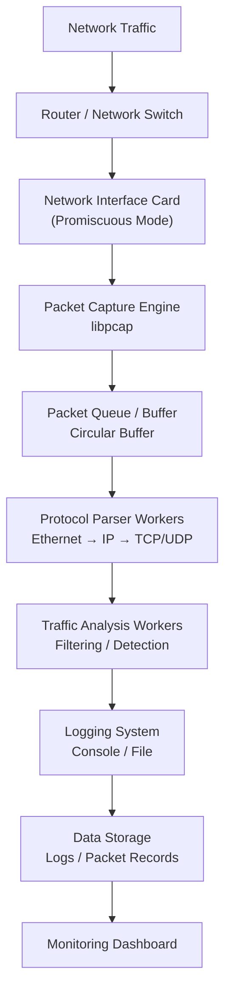

# System Design
# NetScout Sniffer – Complete System Design “Super Diagram”

This final diagram combines **all major architectural ideas** students learned:

* network packet flow
* protocol layers
* buffering
* multi-threaded processing
* packet analysis
* logging and monitoring

It mirrors the **system design diagrams used in real engineering design documents**.

---

# 1. Complete Packet Sniffer Architecture



---

# 2. Architecture Layer Explanation

### Network Layer

Traffic originates from:

* users
* servers
* cloud services
* network devices

Packets travel through:

```
Users → Router/Switch → NIC
```

---

### Capture Layer

The **capture engine** retrieves packets from the NIC.

Students typically use:

```
libpcap
```

Responsibilities:

* enable promiscuous mode
* capture raw packets
* send packets to processing pipeline

---

### Buffer / Queue Layer

Packets are stored temporarily in a **buffer queue**.

Purpose:

* prevent packet loss
* smooth traffic spikes
* support multi-threaded processing

Typical structures:

```
circular buffer
ring buffer
message queue
```

---

### Parsing Layer

Parser workers decode packet headers.

Students extract:

```
Ethernet Header
IP Header
TCP Header
UDP Header
```

Example decode order:

```
Ethernet → IP → TCP → Payload
```

---

### Analysis Layer

Analyzer workers inspect packets.

Examples of analysis rules:

```
detect HTTP traffic
monitor DNS queries
track suspicious ports
filter specific IP addresses
```

Example code logic:

```
if (packet.port == 443)
    print("HTTPS traffic detected");
```

---

### Logging Layer

Processed packets are recorded.

Typical formats include:

```
Timestamp
Source IP
Destination IP
Protocol
Port
Packet Size
```

Example output:

```
12:21:08 192.168.1.14 → 8.8.8.8 TCP 443
```

---

### Storage Layer

Logs may be stored in:

* flat files
* databases
* analytics systems

Example storage formats:

```
JSON
CSV
structured logs
```

---

### Visualization Layer

Enterprise systems often include dashboards.

These dashboards show:

* traffic graphs
* suspicious connections
* protocol statistics
* alerts

---

# 3. How This Maps to Real Monitoring Systems

Large enterprise tools follow a nearly identical architecture.

| System Component | Student Project  | Industry Equivalent          |
| ---------------- | ---------------- | ---------------------------- |
| NIC capture      | libpcap          | hardware capture engines     |
| packet queue     | circular buffer  | distributed streaming queues |
| parser           | protocol structs | deep packet inspection       |
| analyzer         | rule filters     | security detection engines   |
| logging          | file output      | analytics platforms          |
| dashboard        | simple logs      | monitoring dashboards        |

---

# 4. Real Industry Pipeline Example

Real monitoring platforms often follow a pipeline like this:

```
Network Traffic
      ↓
Capture Sensors
      ↓
Packet Processing Cluster
      ↓
Threat Detection Engine
      ↓
Distributed Storage
      ↓
Security Dashboard
```

These architectures are used in:

* enterprise cybersecurity platforms
* cloud network monitoring
* intrusion detection systems
* traffic analytics platforms

---

# 5. Student Implementation Roadmap

Students should implement the system step by step.

### Step 1 – Packet Capture

Capture packets from the network interface.

```
pcap_open_live()
pcap_loop()
```

---

### Step 2 – Packet Parsing

Decode protocol headers.

```
Ethernet header
IP header
TCP/UDP header
```

---

### Step 3 – Buffering

Store packets temporarily before processing.

Example:

```
packet_buffer[BUFFER_SIZE]
```

---

### Step 4 – Packet Analysis

Apply simple detection rules.

Examples:

```
port filtering
protocol filtering
IP filtering
```

---

### Step 5 – Logging

Print or save packet data.

Example output:

```
source_ip -> destination_ip protocol port
```

---

# 6. Final Learning Outcome

After completing the project, students will understand:

* packet capture techniques
* network protocol structures
* real-time data pipelines
* buffering and queues
* packet analysis
* monitoring system design

These are foundational skills used in careers such as:

* network engineering
* cybersecurity
* systems programming
* cloud infrastructure
* distributed systems engineering

---

# 7. One-Page Student Reference

```
Network Traffic
      ↓
Network Interface
      ↓
Packet Capture
      ↓
Packet Queue
      ↓
Protocol Parsing
      ↓
Traffic Analysis
      ↓
Logging
      ↓
Storage / Dashboard
```

This is the **core architecture of almost every packet monitoring system**.

---
