# 02-Distributed Key-Value Store

Goal: Build a mini distributed storage system similar to Redis or DynamoDB.
## Distributed Cluster Architecture

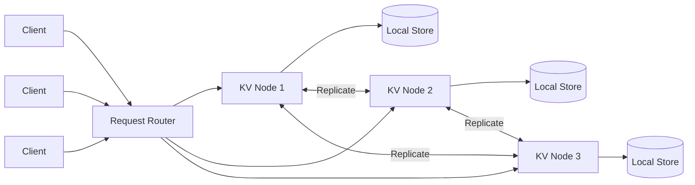
## Scalable State Management and Consensus Logic

### Architectural Overview
This project involves designing a distributed, networked storage engine. The focus is on ensuring data consistency and availability across multiple nodes, simulating the backbone of modern cloud-native infrastructure.

### Technical Requirements
* **Socket Architecture:** Implementation of a multi-threaded server using Java NIO for non-blocking I/O operations.
* **Concurrency Control:** Development of thread-safe mechanisms (Locks, Semaphores) to manage simultaneous read/write operations.
* **Protocol Design:** Definition of a custom binary or JSON-based serialization format for node-to-node communication.

### Engineering Objectives
* Resolve race conditions in a distributed environment.
* Implement a basic leader-follower or peer-to-peer discovery mechanism.
* Optimize data retrieval latency through efficient indexing.
## System Architecture
---

# Conceptual Understanding

Before building the system, it is important to understand **what problem a Distributed Key-Value Store solves**.

Think of it as a **shared memory system spread across multiple computers**.

Instead of storing data in one machine, the data is **distributed across many nodes**, allowing systems to be **scalable, fault tolerant, and fast**.

---

# Day-to-Day Analogy

Imagine a **university library system**.

Each library branch contains shelves with books.

Every book has:
- a **catalog ID** (the key)
- the **book information** (the value)

Example:

```
Key:   CS101
Value: "Introduction to Computer Systems"
```

Now imagine the university has **multiple libraries across campus**.

Students should be able to:

• search for a book  
• borrow a book  
• update availability  

from **any library location**.

To make this work:

- libraries must **communicate with each other**
- they must **agree on which library holds which book**
- they must **keep records synchronized**

Your project works the same way.

Each **server node** acts like a **library branch**.

The system must ensure that:

- data can be stored
- data can be retrieved
- nodes can coordinate with each other
- information stays consistent across the network

---

# Industry Example

Modern technology companies rely heavily on **distributed key-value systems**.

Examples include:

- **User session storage**
- **configuration services**
- **large-scale caching systems**
- **distributed databases**

For example:

When you log into a large online service, your login session might be stored like this:

```
Key:   session_847293
Value: { user: "alice", login_time: "12:01PM", permissions: "standard" }
```

That data must be accessible **from multiple servers** handling millions of requests.

If one server crashes, another server must still be able to retrieve that session.

This is why systems distribute data across **multiple nodes**.

Large-scale platforms use systems similar to this project, such as:

- distributed caches
- coordination services
- configuration stores
- metadata services

Your project simulates the **core infrastructure behind these systems**.

---

# What You Are Building

In this project you will create a **simplified distributed storage engine**.

Your system will:

1. Start a server node
2. Accept network connections
3. Store key-value data
4. Handle multiple concurrent clients
5. Communicate with other nodes
6. Maintain consistent state across the system

Each server will act as a **node in a distributed cluster**.

---

# What To Do Next

Follow these steps to begin building the system.

### Step 1 — Start the Server Node

You already have the starting point:

```
Server.java
```

Your first task is to create a **network server using Java NIO** that listens for incoming client requests.

---

### Step 2 — Implement Request Handling

Your server should support basic operations:

```
PUT key value
GET key
DELETE key
```

Example interaction:

```
PUT user1 Alice
GET user1
DELETE user1
```

---

### Step 3 — Add Thread Safety

Multiple clients may connect at the same time.

You must ensure your storage system is **thread-safe**.

Possible approaches:

- synchronized structures
- locks
- concurrent hash maps

---

### Step 4 — Node Communication

The next stage is enabling **node-to-node communication**.

Servers should be able to:

- share updates
- replicate data
- discover other nodes

This simulates a **distributed cluster**.

---

# Engineering Goal

By the end of this project you will have built a **mini distributed storage system**, similar in architecture to the systems used in modern infrastructure platforms.

The purpose is not just to build code, but to understand:

- distributed system coordination
- data consistency
- concurrent processing
- scalable backend architecture

These are core skills required to design **large-scale infrastructure systems**.

Client
  │
  ▼
Node A  ── Node B ── Node C
  │
Distributed Key-Value Storage

## System Architecture
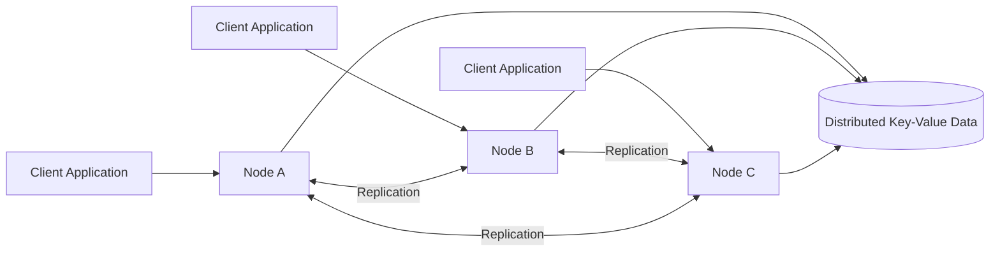
## Client Request Flow

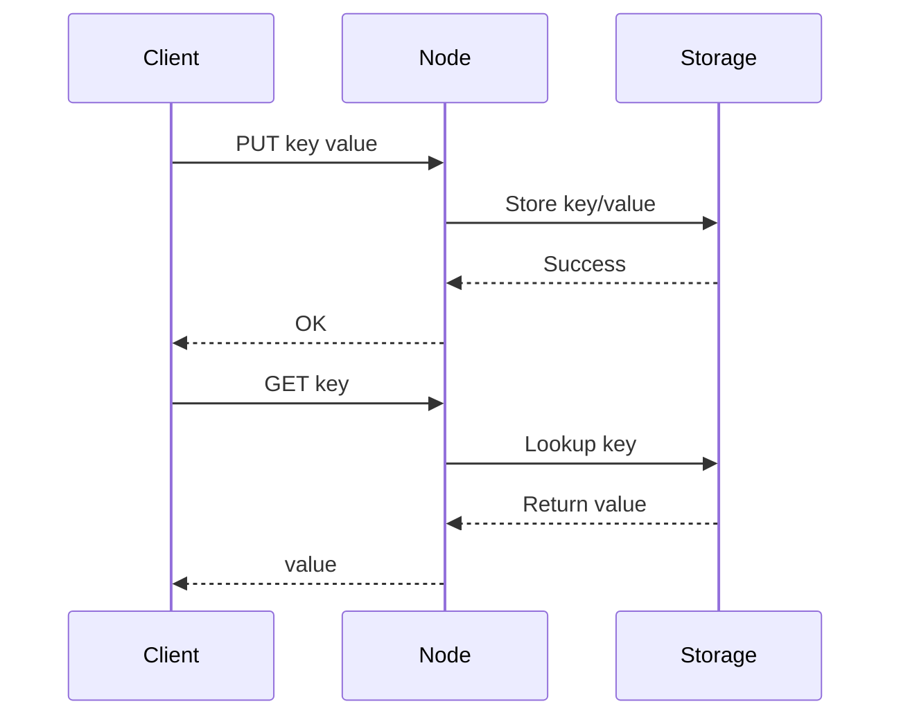
## Node Replication Model

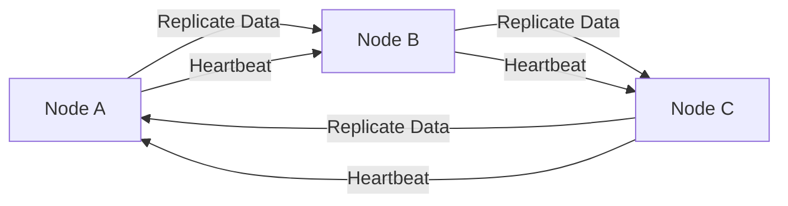
## Node Internal Architecture

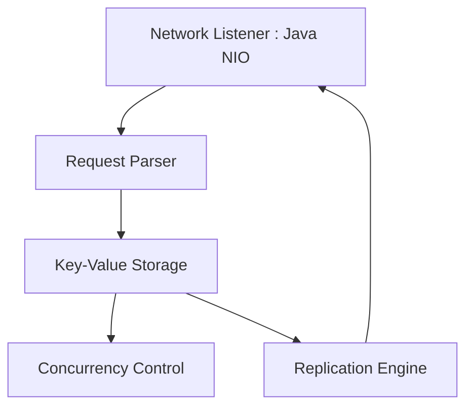
## Project Development Roadmap

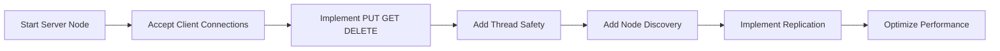
## Real-World Infrastructure Analogy

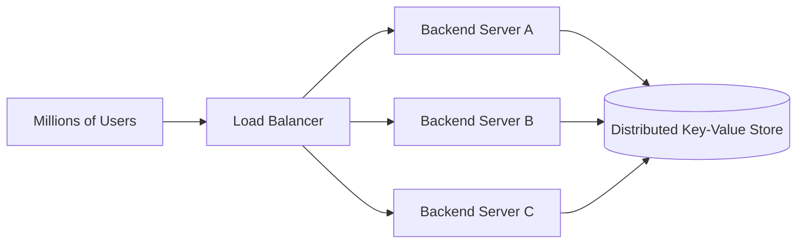
## Key-Value Data Model

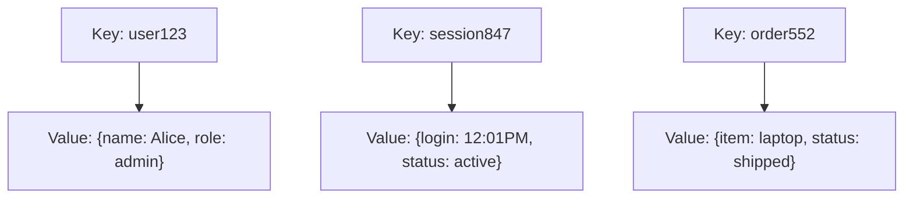
## Data Partitioning Across Nodes

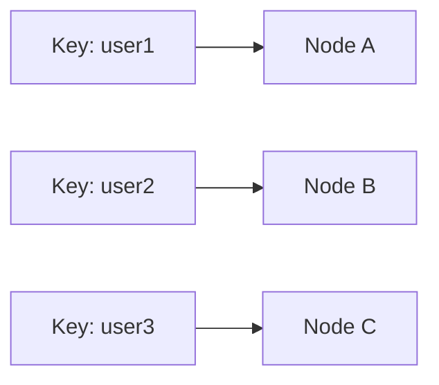
## Node Replication Process

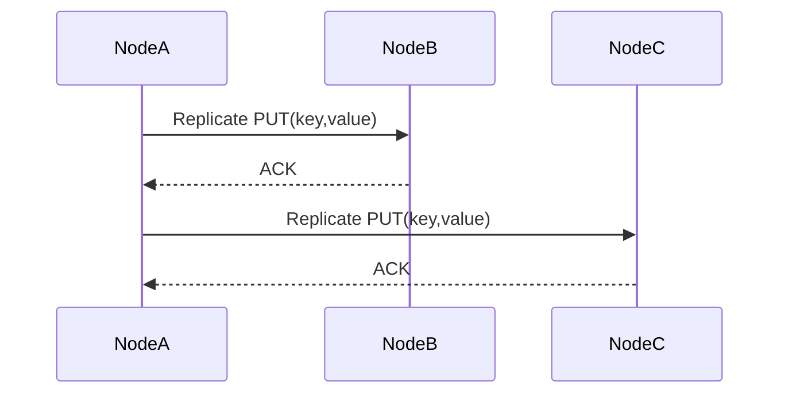
## Client Command Flow

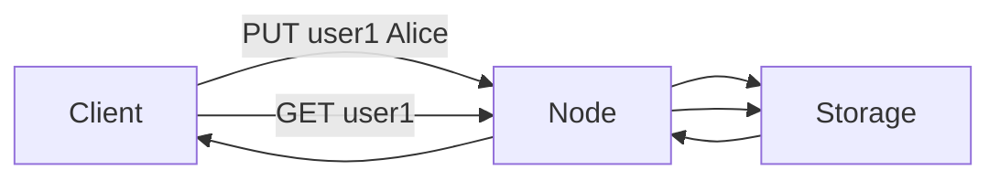
## Server Node Internal Components

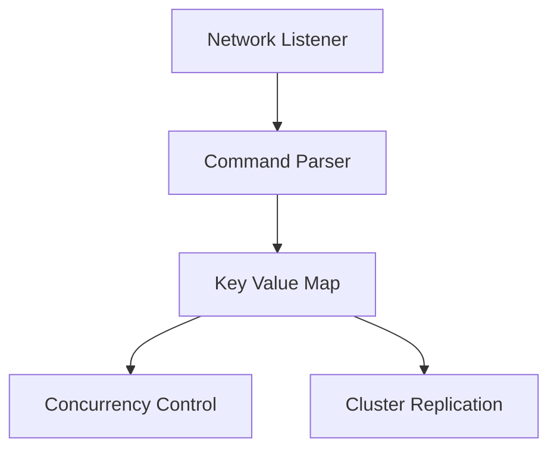
## Project Implementation Roadmap

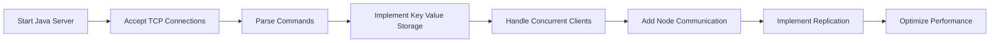

# Systems Infrastructure Laboratory – Student Guide

## 1️⃣ Mapping Components to Code Responsibilities

This maps directly to the code that must be written. Each component corresponds to a key part of the system:

| **Component**        | **Code Responsibility**                        | ** Hint / Example** |
|----------------------|-----------------------------------------------|--------------------|
| <span style="color:#ff6f61;">Network Listener</span> | Java NIO server                               | Use `ServerSocketChannel` to accept multiple clients. |
| <span style="color:#6f4fff;">Parser</span>           | Parse PUT/GET commands                        | Split input strings and validate commands. |
| <span style="color:#f4d03f;">Storage</span>          | HashMap or ConcurrentHashMap                  | `ConcurrentHashMap` is safer for multi-threaded access. |
| <span style="color:#1abc9c;">Threading</span>        | Multi-client handling                          | Consider `ExecutorService` for managing threads. |
| <span style="color:#e67e22;">Replication</span>      | Node communication                             | Use sockets or REST APIs to sync data between nodes. |

> 🔹 **Pro Tip:** Think of this as the **blueprint** — each row is a mini-project in itself!  

---

## 2️⃣ How This Connects to Real Systems

Students love seeing industry relevance. Large systems use similar architectures. Your project is a mini version of these systems:

| **System**             | **Use Case**                     | **Why it Matters** |
|------------------------|---------------------------------|------------------|
| <span style="color:#ff6f61;">Redis</span>                  | Distributed caching             | Fast retrieval of frequently accessed data |
| <span style="color:#6f4fff;">Apache Cassandra</span>       | Massive distributed databases   | Handles huge volumes of data reliably |
| <span style="color:#1abc9c;">Amazon DynamoDB</span>        | Large-scale key-value storage   | Scales automatically for high traffic |

> 🔹 **Pro Tip:** Think of your project as a **hands-on mini version** of these enterprise systems!  

---

## 3️⃣ Visual Diagram of System Architecture

- <span style="color:#ff6f61;">**Network Listener:**</span> Handles incoming client requests.  
- <span style="color:#6f4fff;">**Parser:**</span> Processes PUT/GET commands.  
- <span style="color:#f4d03f;">**Storage:**</span> Stores data using HashMap/ConcurrentHashMap.  
- <span style="color:#1abc9c;">**Threading:**</span> Enables handling of multiple clients simultaneously.  
- <span style="color:#e67e22;">**Replication:**</span> Synchronizes data with other nodes.  

> 🔹 **Pro Tip:** Use this diagram as your **roadmap** — it’s the visual equivalent of your project’s backbone!

---

###  Quick Takeaways

1. Each component in your project maps to a real-world system component.  
2. Multi-threading and replication are critical for real systems — now you get to implement them!  
3. This mini project mirrors industry-scale architectures like Redis, Cassandra, and DynamoDB.  

> **Challenge:** Try to trace a PUT or GET request from the **Network Listener** all the way to **Replication** — that’s how real distributed systems work!

