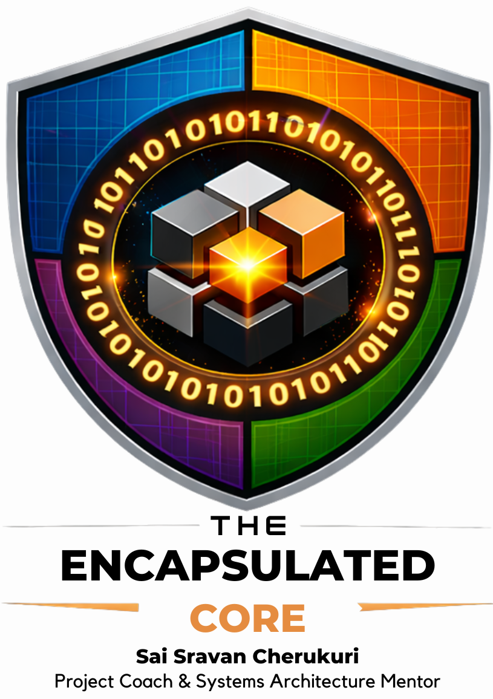

  

# Systems Infrastructure Lab
**Performance-Critical Systems | Distributed Logic | Applied Cryptography**

## Systems Infrastructure Lab

Welcome to the **Systems Infrastructure Lab**, a professional-grade engineering environment dedicated to mastering **performance-critical software, distributed infrastructure, and security-first platform architecture**.

This repository serves as a **technical roadmap and experimental laboratory** for developing expertise in **low-level C++ systems programming and enterprise Java platform engineering**, explored through real-world systems design challenges and modern infrastructure patterns.

The lab integrates concepts across multiple engineering domains, including:

* **High-performance C++ systems programming**
* **Enterprise Java architecture and scalable backend services**
* **Distributed systems and infrastructure design**
* **Network engineering and traffic analysis**
* **Applied cryptography and blockchain security**

Through structured projects, architectural experiments, and production-inspired implementations, this repository emphasizes **deep systems understanding, performance optimization, and secure-by-design engineering practices**.

The goal is to cultivate the skills required to design and build **robust, scalable, and secure computing platforms** for modern enterprise and high-performance environments.

---

## Laboratory Overview
This curriculum is divided into five specialized engineering paths. Each path challenges your architectural thinking and technical precision.

* **[01-NetScout Sniffer](./01-netscout-sniffer)**: Low-level network analysis and packet deconstruction (C++).
* **[02-Distributed-KV](./02-distributed-kv)**: Scalable state management and consensus logic (Java).
* **[03-Sys-Monitor](./03-sys-monitor)**: Cross-language integration and system telemetry (C++ & Java).
* **[04-Credential-Chain](./04-credential-chain)**: Cryptographic identity and immutable ledgers (Java).
* **[05-Algo-Backtester](./05-algo-backtester)**: High-throughput data processing and quantitative logic (C++).

---

## Getting Started
To begin your tenure in the lab, follow these steps in order:

1. **Review the Persona Guide:** Read the [Getting Started Guide](./GETTING_STARTED.md) to choose your project path.
2. **Understand the Standards:** Review our [Technical Standards](./.github/TECHNICAL_STANDARDS.md) for coding protocols.
3. **Learn the Workflow:** Follow the [Workflow Guide](./.github/WORKFLOW_GUIDE.md) to manage your progress via GitHub Issues.
4. **Initialize Project 0:** Set up your environment as detailed in the first Issue.

---

## Operational Resources
* **[Graduation Rubric](./.github/GRADUATION_RUBRIC.md):** The standards required for final certification.
* **[Contribution Guide](./.github/WORKFLOW_GUIDE.md):** How to branch, commit, and submit Merge Requests.

---
*Directed by Sai Sravan Cherukuri | Project Coach & Systems Architecture Mentor*

